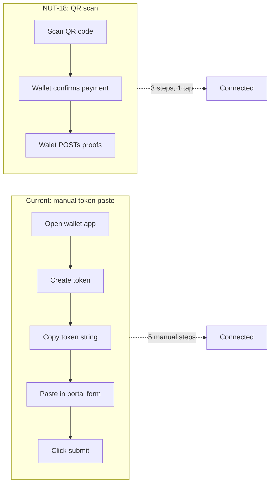
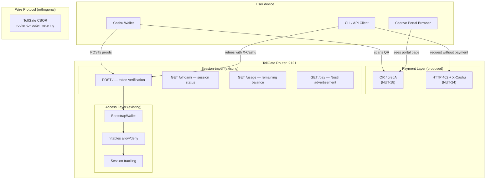
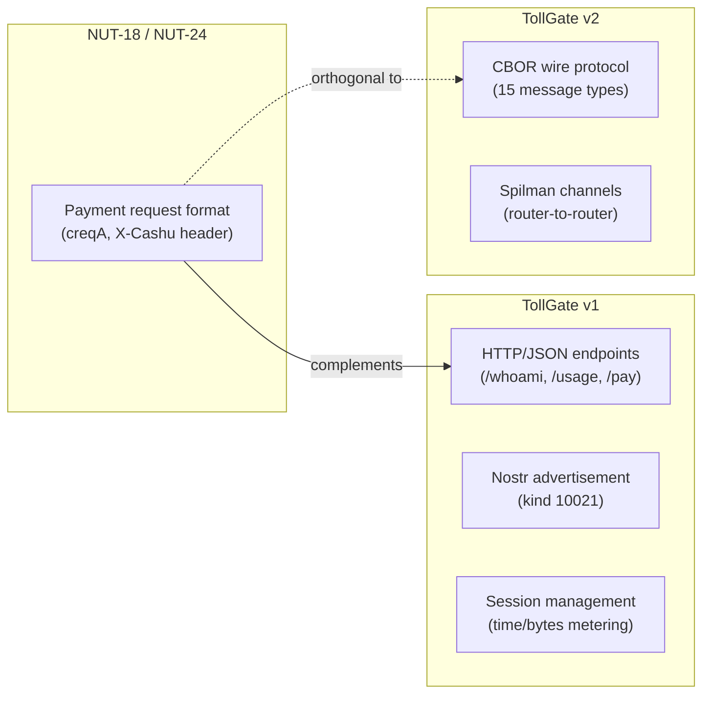
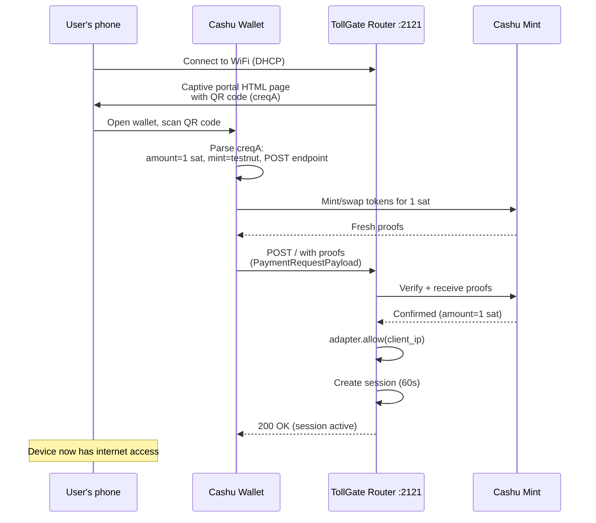
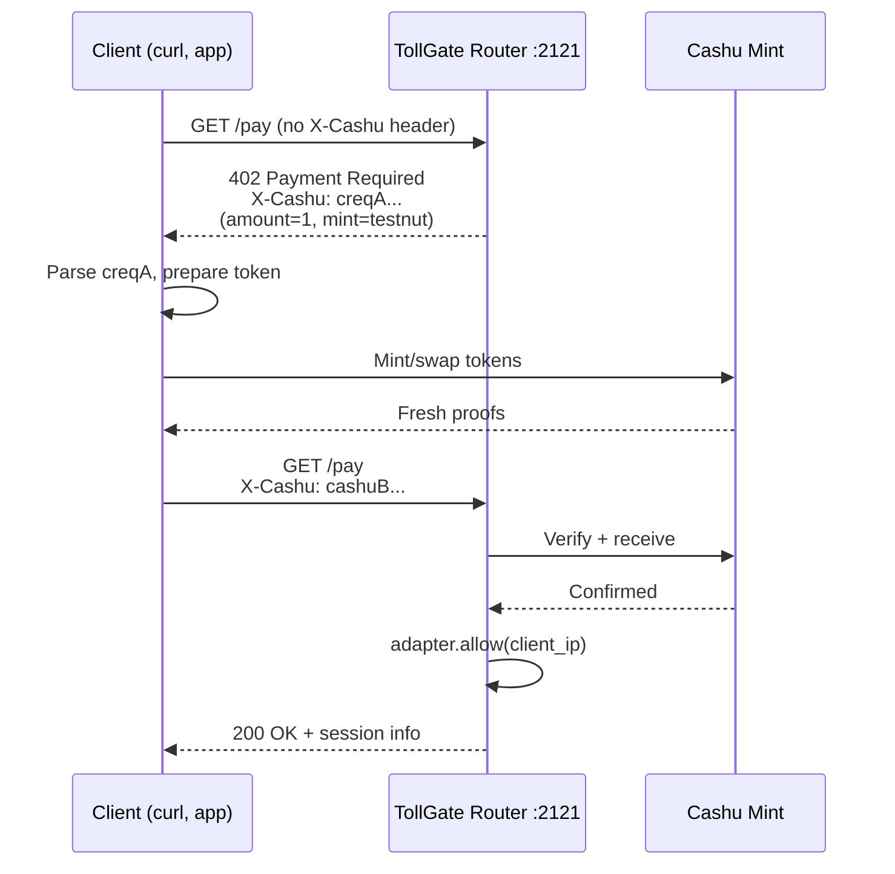
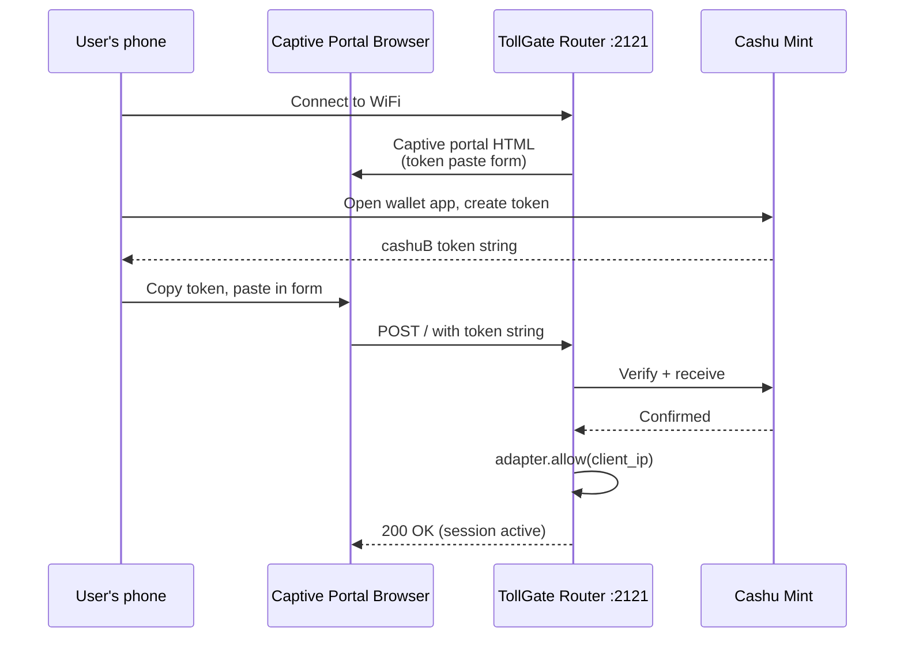

# Proposal: NUT-18 / NUT-24 Payment Requests for TollGate

**Status:** Open for discussion
**Author:** Amperstrand
**Relevant specs:** [NUT-18](https://github.com/cashubtc/nuts/blob/main/18.md), [NUT-24](https://github.com/cashubtc/nuts/blob/main/24.md)

---

## TL;DR

TollGate's captive portal currently requires users to manually copy-paste a `cashuB`
token string into a browser form field. NUT-18 (Payment Requests) and NUT-24 (HTTP 402)
are Cashu protocol standards that would let any Cashu wallet pay a TollGate router
by scanning a QR code or receiving an HTTP 402 — no manual token copying needed.

This document proposes adopting NUT-18/NUT-24 as an **additive** payment layer.
The TollGate v1 endpoints and CBOR wire protocol remain unchanged. Open question:
should this live in v1 (HTTP/JSON compat) or v2 (CBOR protocol)?

---

## Problem

The current captive portal flow requires five manual steps:

```
User's phone                     TollGate router
────────────                     ────────────────
1. Connect to WiFi
2. Captive portal popup appears
3. Open Cashu wallet app
4. Create/send token ──────────> 5. Copy token string
6. Switch to portal browser
7. Paste token in form field ──> 8. Click "Pay and Connect"
                                  9. Router verifies token
                                 10. Firewall opens
```

Steps 3–8 are friction. The user must context-switch between their wallet app and
the captive portal browser, manually copy a long token string, and paste it.
On mobile devices with restricted captive portal browsers, this is especially painful.

Every other Cashu-powered service in the ecosystem (Routstr, nodns, nomail,
blossomflare) uses NUT-18/NUT-24 for a reason: it eliminates this friction.

---

## What NUT-18 Does

NUT-18 defines a **receiver-initiated payment request** format. The router generates
a `creqA` string (CBOR + base64url) encoding:

| Field | Meaning | TollGate value |
|-------|---------|----------------|
| `a` | Amount in sats | `price_per_step` (e.g. 1) |
| `u` | Unit | `"sat"` |
| `m` | Accepted mint URLs | From config |
| `d` | Description | `"TollGate internet access"` |
| `t` | Transport | `[{type: "post", target: "http://gateway:2121/"}]` |
| `s` | Single use | `true` |

The wallet opens this request, constructs the token, and POSTs proofs to the target
endpoint automatically. No manual copying.

### Current flow vs NUT-18 flow



---

## What NUT-24 Does

NUT-24 wraps NUT-18 in the HTTP layer using status code **402 Payment Required**:

1. Client requests a resource without payment
2. Server returns `402` with `X-Cashu` header containing the `creqA` payment request
3. Cashu-aware client reads the header, pays, and retries with `X-Cashu` containing the token
4. Server verifies the token and returns `200` + the resource

This is stateless — the 402 carries everything needed. The server derives price from
the request itself (no database lookup before the 402).

**Precedent:** Routstr uses exactly this pattern. An OpenAI-compatible API where each
request returns 402 + `X-Cashu`, and the client retries with a token. Any Cashu wallet
or HTTP client that speaks NUT-24 works out of the box.

---

## Proposed Architecture

NUT-18/NUT-24 sit at the **payment request layer**, not the wire protocol layer.
They don't replace TollGate endpoints — they standardize how payment is presented.



### Layer separation



NUT-18/24 handle **wallet → router** payment. TollGate v1 handles **session management**.
TollGate v2 (CBOR) handles **router → router** metering. Three distinct concerns, three layers.

---

## Detailed Flow Diagrams

### 1. NUT-18 QR scan flow (primary — best UX)



### 2. NUT-24 HTTP 402 flow (for API clients, CLI tools)



### 3. Current flow for comparison (unchanged — backward compatible)



---

## v1 or v2? Open Question

This is the main discussion point. Arguments for each:

### Option A: Implement in v1 (HTTP/JSON compat server)

**For:**
- The v1 server already handles HTTP payment (POST /)
- The captive portal HTML page already lives in v1
- Session tracking, Nostr advertisement, adapter allow/deny are all in v1
- NUT-18/24 are HTTP-level standards — they naturally fit the HTTP server
- Can ship immediately without touching the CBOR protocol

**Against:**
- v1 is supposed to be the "Go compatibility layer" — adding new standards extends it beyond compatibility
- If upstream adopts NUT-18 in the v2 path, we'd have it in two places

### Option B: Implement in v2 (CBOR protocol path)

**For:**
- v2 is the future — if TollGate standardizes on NUT-18, it should be in the canonical path
- The BootstrapToken message (0x07) could carry a NUT-18 payment request reference instead of a raw token
- Aligns with upstream's protocol-first approach

**Against:**
- NUT-18/24 are HTTP/transport standards, not CBOR wire messages
- The CBOR protocol is router-to-router; NUT-18 is wallet-to-router
- Mixing HTTP payment standards into the CBOR message layer conflates concerns
- Upstream may have different ideas about bootstrap token format

### Option C: Separate module, used by both v1 and v2

**For:**
- NUT-18 `creqA` generation is pure logic (CBOR encode + base64url) — no transport dependency
- Could be a standalone function in `tollgate-protocol` or a new `tollgate-payment` crate
- Both v1 and v2 can call it independently
- Cleanest separation of concerns

**Against:**
- Adds a new crate or module for a small amount of code

### Recommendation (open to discussion)

**Option A for now, structured for Option C later.** Implement NUT-18/24 in the v1
HTTP server because that's where the captive portal and payment POST handler live.
But put the `creqA` generation logic in a standalone function (not embedded in an
HTTP handler) so it can be extracted into a shared module if v2 adopts it later.

---

## Implementation Sketch

### creqA generation (pure function, no HTTP dependency)

```rust
/// Build a NUT-18 payment request encoded as `creqA` (CBOR + base64url).
///
/// The wallet scans this string (via QR code or deep link), constructs a token
/// from an accepted mint, and POSTs the proofs to `post_endpoint`.
pub fn create_payment_request(
    amount: u64,
    unit: &str,
    mints: &[String],
    description: &str,
    post_endpoint: &str,
) -> String {
    // CBOR-encode {a: amount, u: unit, m: mints, d: description,
    //              t: [{t: "post", a: post_endpoint}], s: true}
    // then base64url-encode with "creqA" prefix.
    // Total: ~30 lines of code.
    todo!()
}
```

### Captive portal HTML change

Add a QR code to the existing portal page. The QR encodes the `creqA` string.
Below the QR, keep the existing manual token paste field as a fallback.

```
┌──────────────────────────────┐
│         TollGate             │
│   Pay-per-use internet       │
│                              │
│   ┌────────────────────┐     │
│   │                    │     │
│   │    ▓▓▓▓▓▓▓▓▓▓      │     │
│   │    ▓▓░░░░░░▓▓      │     │
│   │    ▓▓░▓▓░▓░▓▓      │     │   ← QR code (creqA)
│   │    ▓▓░░░▓░░░▓▓      │     │
│   │    ▓▓░▓▓░▓▓░▓▓      │     │
│   │    ▓▓░░░░░░▓▓      │     │
│   │    ▓▓▓▓▓▓▓▓▓▓      │     │
│   │                    │     │
│   └────────────────────┘     │
│   Scan with your Cashu wallet│
│                              │
│   ── or paste a token ──     │
│   ┌────────────────────┐     │
│   │ cashuB...           │     │   ← existing manual field
│   └────────────────────┘     │
│   [Pay and Connect]          │
│                              │
│   1 sat per 1min             │
└──────────────────────────────┘
```

### HTTP 402 endpoint (for API clients)

```rust
/// GET /pay without X-Cashu header → 402 + payment request
async fn handle_pay(
    headers: HeaderMap,
    state: State<Arc<V1State>>,
) -> Response {
    if headers.contains_key("x-cashu") {
        // Client is paying — existing flow
        return handle_get_details(headers, state).await;
    }
    // No payment — return 402 with NUT-18 request
    let creq_a = create_payment_request(
        state.config.price_per_step,
        "sat",
        &state.config.mints,
        "TollGate internet access",
        &format!("http://{}/", state.listen_addr),
    );
    (
        StatusCode::PAYMENT_REQUIRED,
        [
            ("X-Cashu", HeaderValue::from_str(&creq_a).unwrap()),
            ("Access-Control-Expose-Headers", HeaderValue::from_static("X-Cashu")),
        ],
        "Payment Required",
    ).into_response()
}
```

---

## Ecosystem Precedent

| Project | What it sells | Payment standard | NUT-18 | NUT-24 |
|---------|--------------|-----------------|--------|--------|
| **Routstr** | LLM API calls | Cashu + Lightning | QR + deep link | `X-Cashu` 402 |
| **nodns** | DNS names | Cashu | Nostr-embedded | `X-Cashu` 402 |
| **nomail** | Email sending | Cashu | — | JSON body 402 |
| **blossomflare** | File storage | Cashu | — | `X-Cashu` 402 |
| **TollGate** (current) | Network access | Cashu | — | — |

TollGate is the only major Cashu service that doesn't use NUT-18 or NUT-24.

---

## Open Questions

1. **v1 or v2?** Should NUT-18/24 live in the v1 HTTP server, the v2 CBOR protocol, or a shared module? (See Options A/B/C above.)

2. **QR code library?** Generating a QR code requires either a Rust QR library (e.g. `qrcode` crate) or client-side JavaScript (e.g. a tiny inline QR generator). For the captive portal HTML page, client-side JS avoids adding a Rust dependency. For API/NUT-24, no QR is needed.

3. **NUT-10 locking conditions?** Should the payment request include P2PK locking? The router verifies proofs at the mint regardless, so locking is not strictly necessary. But it could enable offline verification patterns later.

4. **Multi-mint discovery?** The `creqA` includes the accepted mint list. Should we also surface this in the Nostr advertisement (kind 10021) so wallets know before connecting?

5. **Upstream coordination?** Should this be proposed upstream (OpenTollGate/tollgate-rs) as a protocol enhancement, or kept as a deployment-level feature? The argument for upstream: standardizes the bootstrap payment UX across all TollGate implementations. The argument against: NUT-18/24 are deployment concerns, not protocol concerns.

---

## References

- [NUT-18: Payment Requests](https://github.com/cashubtc/nuts/blob/main/18.md)
- [NUT-24: HTTP 402 Payment Required](https://github.com/cashubtc/nuts/blob/main/24.md)
- [NUT-20: Signature on Mint Quote](https://github.com/cashubtc/nuts/blob/main/20.md)
- [Routstr docs](https://docs.routstr.com) — decentralized LLM marketplace using Cashu
- [Awesome Cashu](https://github.com/cashubtc/awesome-cashu) — ecosystem overview
- [cashu-ts PaymentRequest](https://github.com/cashubtc/cashu-ts) — reference wallet implementation
- TollGate v1 captive portal: `crates/tollgate-net/src/v1/handlers.rs`
- TollGate protocol spec: `docs/design/core/tollgate-protocol.md`
